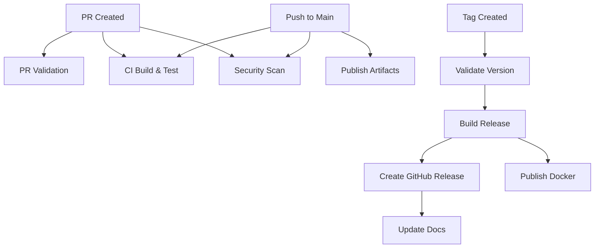

# GitHub Actions Workflows Documentation

This directory contains the CI/CD automation for the Bike Share Sync project.

## Workflow Files

### Core Workflows

#### [`ci.yml`](./workflows/ci.yml)
**Purpose:** Main continuous integration pipeline
**Triggers:** Push to main/develop, Pull requests
**Jobs:**
- Build and test on multiple OS (Ubuntu, Windows, macOS)
- Code quality analysis
- Security vulnerability scanning
- Performance testing
- Integration testing
- Artifact publishing

#### [`security.yml`](./workflows/security.yml)
**Purpose:** Comprehensive security scanning
**Triggers:** Push to main/develop, Weekly schedule, Manual
**Jobs:**
- CodeQL static analysis
- OWASP dependency checking
- Trivy vulnerability scanning
- Secret detection (Trufflehog, GitLeaks)
- License compliance verification
- SBOM generation

#### [`release.yml`](./workflows/release.yml)
**Purpose:** Automated release creation
**Triggers:** Version tags (v*), Manual with version input
**Jobs:**
- Version validation
- Multi-platform binary builds
- GitHub release creation
- Docker image publishing
- Documentation updates

#### [`pr-validation.yml`](./workflows/pr-validation.yml)
**Purpose:** Pull request quality gates
**Triggers:** PR opened/synchronized/reopened
**Jobs:**
- PR metadata validation
- Automated code review
- Test coverage analysis
- Documentation checking
- Performance regression testing
- PR summary generation

### Configuration Files

#### [`dependabot.yml`](../dependabot.yml)
**Purpose:** Automated dependency updates
**Schedule:** Weekly for NuGet, Monthly for Actions
**Features:**
- Grouped updates for related packages
- Auto-assignment to reviewers
- Security update prioritization

#### [`labeler.yml`](../labeler.yml)
**Purpose:** Automatic PR labeling based on files changed
**Labels:** documentation, source-code, tests, dependencies, etc.

## Secrets Configuration

Required and optional secrets for full functionality:

| Secret | Required | Used By | Purpose |
|--------|----------|---------|---------|
| `GITHUB_TOKEN` | ✅ (Automatic) | All workflows | GitHub API access |
| `CODECOV_TOKEN` | ❌ | ci.yml | Coverage reporting |
| `DOCKER_USERNAME` | ❌ | release.yml | Docker Hub login |
| `DOCKER_PASSWORD` | ❌ | release.yml | Docker Hub auth |

## Workflow Triggers

| Trigger Type | Workflows | Description |
|--------------|-----------|-------------|
| Push | ci, security | Code pushed to main/develop |
| Pull Request | ci, pr-validation | PR opened or updated |
| Schedule | security, dependabot | Periodic automated runs |
| Tag | release | Version tags (v*) |
| Manual | all | workflow_dispatch event |

## Job Dependencies



## Environment Variables

Common environment variables used across workflows:

```yaml
DOTNET_VERSION: '8.0.x'
DOTNET_NOLOGO: true
DOTNET_SKIP_FIRST_TIME_EXPERIENCE: true
DOTNET_CLI_TELEMETRY_OPTOUT: true
```

## Artifacts

| Artifact | Workflow | Retention | Contents |
|----------|----------|-----------|----------|
| test-results-* | ci.yml | 7 days | Test results and logs |
| coverage-report | pr-validation.yml | 7 days | HTML coverage report |
| performance-results | ci.yml | 30 days | Benchmark results |
| release-binaries | release.yml | 30 days | Platform executables |
| security-reports | security.yml | 30 days | Scan results |

## Performance Optimizations

### Caching Strategy
- NuGet packages cached by OS and hash
- Docker layers cached for builds
- Test results cached between jobs

### Parallel Execution
- Matrix builds for OS/configuration combinations
- Independent jobs run concurrently
- Fail-fast disabled for complete results

### Resource Limits
- Default timeout: 360 minutes
- Job timeouts: 10-30 minutes
- Concurrent jobs: Based on plan (20 for free)

## Maintenance

### Updating Workflows

1. Test changes in feature branch first
2. Use `workflow_dispatch` for manual testing
3. Monitor first run after merge
4. Update documentation if needed

### Monitoring Health

Check these regularly:
- Actions tab for success rates
- Security tab for alerts
- Insights → Actions for metrics
- Settings → Actions for usage

### Debugging Workflows

Enable debug logging:
```yaml
env:
  ACTIONS_RUNNER_DEBUG: true
  ACTIONS_STEP_DEBUG: true
```

Or via repository secrets:
- `ACTIONS_RUNNER_DEBUG`: `true`
- `ACTIONS_STEP_DEBUG`: `true`

## Best Practices

### Do's ✅
- Pin action versions (`uses: actions/checkout@v4`)
- Use secrets for sensitive data
- Set appropriate timeouts
- Cache dependencies
- Run tests in parallel
- Clean up artifacts

### Don'ts ❌
- Hard-code credentials
- Use `latest` tags
- Skip error handling
- Ignore failing tests
- Disable security scans
- Store large artifacts

## Workflow Templates

### Adding a New Workflow

```yaml
name: Workflow Name
on:
  workflow_dispatch:  # Manual trigger for testing

jobs:
  job-name:
    runs-on: ubuntu-latest
    steps:
    - uses: actions/checkout@v4
    - name: Your step
      run: echo "Hello"
```

### Adding a Matrix Build

```yaml
strategy:
  matrix:
    os: [ubuntu-latest, windows-latest]
    version: [8.0, 9.0]
  fail-fast: false
runs-on: ${{ matrix.os }}
```

## Troubleshooting

### Common Issues

| Issue | Solution |
|-------|----------|
| Workflow not triggering | Check branch names and paths filters |
| Permission denied | Update workflow permissions in Settings |
| Secrets not working | Verify exact name match (case-sensitive) |
| Cache miss | Update cache key or clear cache |
| Timeout | Increase timeout or optimize steps |

### Getting Logs

```bash
# Via GitHub CLI
gh run view <run-id> --log
gh run download <run-id>

# Via UI
Actions → Click run → Click job → Expand step
```

## Support

- **Documentation:** `/docs/CICD_OPERATIONS_GUIDE.md`
- **Quick Start:** `/docs/CICD_QUICK_START.md`
- **Issues:** Create issue with `ci/cd` label
- **GitHub Actions Docs:** [docs.github.com/actions](https://docs.github.com/actions)

---

*Generated by CI/CD Pipeline Implementation v1.0*