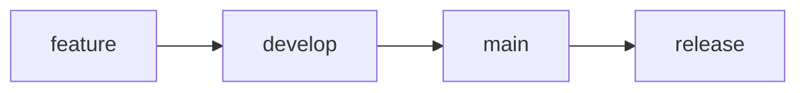

# GitHub Actions CI/CD Operations Guide

## Table of Contents
- [Overview](#overview)
- [Initial Setup](#initial-setup)
- [Daily Operations](#daily-operations)
- [Monitoring Workflows](#monitoring-workflows)
- [Handling Failures](#handling-failures)
- [Creating Releases](#creating-releases)
- [Security Operations](#security-operations)
- [Maintenance Tasks](#maintenance-tasks)
- [Troubleshooting](#troubleshooting)
- [Best Practices](#best-practices)

## Overview

The CI/CD pipeline automates building, testing, security scanning, and releasing the Bike Share Sync tool. All workflows are defined in `.github/workflows/` and run automatically based on triggers.

### Workflow Components

| Workflow | File | Trigger | Purpose |
|----------|------|---------|---------|
| CI Build & Test | `ci.yml` | Push, PR | Build, test, code quality |
| Security | `security.yml` | Push, Weekly | Vulnerability scanning |
| Release | `release.yml` | Version tags | Create releases |
| PR Validation | `pr-validation.yml` | Pull requests | PR quality gates |
| Dependabot | `dependabot.yml` | Weekly | Dependency updates |

## Initial Setup

### 1. Prerequisites

- GitHub repository with Actions enabled
- Repository admin access for configuration
- Git installed locally

### 2. Enable GitHub Actions

```bash
# Push the workflows to your repository
git add .github/
git commit -m "ci: Add GitHub Actions workflows"
git push origin main
```

### 3. Configure Repository Settings

Navigate to your repository on GitHub, then:

#### Actions Permissions
**Settings → Actions → General**
- Workflow permissions: **Read and write permissions**
- Allow GitHub Actions to create and approve pull requests: **✓**

#### Branch Protection
**Settings → Branches → Add rule**
- Branch name pattern: `main`
- Require status checks to pass: **✓**
  - Select: `Build and Test (ubuntu-latest, Release)`
  - Select: `Code Quality Analysis`
  - Select: `Security Vulnerability Scan`
- Require branches to be up to date: **✓**

### 4. Add Required Secrets

**Settings → Secrets and variables → Actions → New repository secret**

| Secret Name | Description | Required | How to Get |
|------------|-------------|----------|------------|
| `CODECOV_TOKEN` | Coverage reporting | Optional | [codecov.io](https://codecov.io) |
| `DOCKER_USERNAME` | Docker Hub username | Optional | Docker Hub account |
| `DOCKER_PASSWORD` | Docker Hub token | Optional | Docker Hub settings |

### 5. Update Configuration Files

Edit `.github/dependabot.yml`:
```yaml
reviewers:
  - "@your-github-username"  # Replace with your actual username
```

## Daily Operations

### Viewing Workflow Status

1. Navigate to **Actions** tab in your repository
2. View workflow runs organized by workflow name
3. Click on any run to see detailed logs

### Understanding Status Badges

Add these to your README.md:
```markdown


```

### Working with Pull Requests

1. **Create a feature branch:**
```bash
git checkout -b feature/my-feature
# Make changes
git add .
git commit -m "feat: Add new feature"
git push origin feature/my-feature
```

2. **Open PR on GitHub**
   - Automated checks will run
   - Review the PR comment with metrics
   - Address any failing checks

3. **PR Checks Include:**
   - ✅ Build on multiple OS
   - ✅ All tests passing
   - ✅ Code coverage maintained
   - ✅ No security vulnerabilities
   - ✅ Code formatting correct
   - ✅ Documentation updated

### Monitoring Test Coverage

Coverage reports are automatically generated for PRs:

1. Check PR comments for coverage summary
2. View detailed reports in **Artifacts** section
3. Coverage trends available on Codecov dashboard

## Monitoring Workflows

### Real-time Monitoring

```bash
# Using GitHub CLI (gh)
gh run list
gh run view <run-id>
gh run watch <run-id>
```

### Workflow Metrics Dashboard

Access via **Actions → Overview**:
- Success/failure rates
- Workflow run duration
- Billable time usage

### Email Notifications

Configure in **Settings → Notifications**:
- Failed workflow runs
- Your PR check results
- Security alerts

## Handling Failures

### Common CI Build Failures

#### Test Failures
```bash
# View test results
gh run view <run-id> --log

# Download test artifacts
gh run download <run-id> -n test-results-ubuntu-latest-Release

# Re-run locally
dotnet test --configuration Release
```

#### Build Errors
```bash
# Clear and rebuild locally
dotnet clean
dotnet restore
dotnet build --configuration Release
```

### Security Scan Failures

#### Vulnerability Found
1. Check Security tab for details
2. Update affected package:
```bash
dotnet add package <PackageName> --version <SafeVersion>
```
3. Commit and push fix

#### Secret Detected
1. **Immediately revoke the exposed secret**
2. Remove from code
3. Add to `.gitignore` if needed
4. Use GitHub Secrets instead

### Re-running Failed Workflows

Via GitHub UI:
1. Go to **Actions** tab
2. Click on failed workflow run
3. Click **Re-run all jobs** or **Re-run failed jobs**

Via GitHub CLI:
```bash
gh run rerun <run-id>
gh run rerun <run-id> --failed  # Only failed jobs
```

## Creating Releases

### Semantic Versioning

Follow semantic versioning (MAJOR.MINOR.PATCH):
- **MAJOR**: Breaking changes
- **MINOR**: New features, backward compatible
- **PATCH**: Bug fixes

### Manual Release Process

1. **Update version in code** (if applicable):
```csharp
// In AssemblyInfo or project file
[assembly: AssemblyVersion("1.2.0")]
```

2. **Create and push tag:**
```bash
# Create annotated tag
git tag -a v1.2.0 -m "Release version 1.2.0"

# Push tag to trigger release workflow
git push origin v1.2.0
```

3. **Monitor release workflow:**
```bash
gh run list --workflow=release.yml
gh run watch
```

4. **Verify release:**
- Check **Releases** page on GitHub
- Verify all platform binaries uploaded
- Test download links

### Automated Release via GitHub UI

1. Go to **Actions** → **Release** workflow
2. Click **Run workflow**
3. Enter version (e.g., `v1.2.0`)
4. Select if pre-release
5. Click **Run workflow**

### Release Artifacts

Each release includes:
- Linux binaries (x64, ARM64)
- Windows binaries (x64, ARM64)
- macOS binaries (x64, ARM64)
- SHA256 checksums
- Release notes

## Security Operations

### Weekly Security Scans

Automated scans run every Monday at midnight:
- CodeQL analysis
- OWASP dependency check
- Trivy vulnerability scan
- Secret detection
- License compliance

### Responding to Security Alerts

1. **Check Security tab** for new alerts
2. **Review alert details** and severity
3. **Apply fixes:**

```bash
# Update vulnerable dependency
dotnet list package --vulnerable
dotnet add package <PackageName> --version <SafeVersion>

# Commit fix
git add *.csproj
git commit -m "security: Update vulnerable package"
git push
```

### Manual Security Scan

```bash
# Trigger security workflow manually
gh workflow run security.yml
```

## Maintenance Tasks

### Updating GitHub Actions

Dependabot automatically creates PRs for Action updates:

1. Review PR for breaking changes
2. Check changelog links
3. Merge if tests pass

### Updating Dependencies

#### Automated Updates (Dependabot)
- Weekly PRs for NuGet packages
- Monthly PRs for GitHub Actions
- Grouped updates for related packages

#### Manual Update
```bash
# Check outdated packages
dotnet list package --outdated

# Update specific package
dotnet add package <PackageName>

# Update all packages
dotnet restore --force-evaluate
```

### Cleaning Up Old Artifacts

Artifacts are auto-deleted based on retention settings:
- Test results: 7 days
- Release artifacts: 30 days
- Security reports: 30 days

Manual cleanup:
```bash
# List artifacts
gh api repos/:owner/:repo/actions/artifacts

# Delete specific artifact
gh api -X DELETE repos/:owner/:repo/actions/artifacts/<artifact-id>
```

### Workflow Optimization

Monitor and optimize slow workflows:

1. **Check timing in Actions tab**
2. **Identify bottlenecks:**
```yaml
- name: Step with timing
  run: |
    echo "::group::Timing"
    time dotnet build
    echo "::endgroup::"
```

3. **Optimize with caching:**
```yaml
- uses: actions/cache@v3
  with:
    path: ~/.nuget/packages
    key: ${{ runner.os }}-nuget-${{ hashFiles('**/*.csproj') }}
```

## Troubleshooting

### Common Issues and Solutions

#### Workflow Not Triggering

**Issue:** Push/PR doesn't trigger workflow

**Solutions:**
- Check workflow file syntax: `yamllint .github/workflows/*.yml`
- Verify branch names match triggers
- Check if workflows are disabled in Settings
- Ensure file has `.yml` extension (not `.yaml`)

#### Permission Denied

**Issue:** Workflow fails with permission error

**Solutions:**
```yaml
# Add to workflow file
permissions:
  contents: write
  pull-requests: write
  checks: write
```

#### Cache Issues

**Issue:** Build uses outdated dependencies

**Solutions:**
```bash
# Clear cache via GitHub UI
Settings → Actions → Caches → Delete

# Or update cache key in workflow
key: ${{ runner.os }}-nuget-v2-${{ hashFiles('**/*.csproj') }}
```

#### Timeout Issues

**Issue:** Workflow times out

**Solutions:**
```yaml
# Increase timeout for job
jobs:
  build:
    timeout-minutes: 30  # Default is 360
```

#### Secret Not Available

**Issue:** Secret returns empty/masked value

**Solutions:**
- Verify secret name matches exactly (case-sensitive)
- Check secret is available for the branch
- Re-create secret if corrupted

### Debug Mode

Enable debug logging for detailed output:

1. **Add repository secrets:**
   - `ACTIONS_RUNNER_DEBUG`: `true`
   - `ACTIONS_STEP_DEBUG`: `true`

2. **Or add to workflow:**
```yaml
env:
  ACTIONS_RUNNER_DEBUG: true
  ACTIONS_STEP_DEBUG: true
```

### Getting Help

1. **Check workflow logs:** Click on failed step for details
2. **GitHub Status:** [status.github.com](https://status.github.com)
3. **GitHub Community:** [github.community](https://github.community)
4. **Repository Issues:** Create issue with workflow logs

## Best Practices

### 1. Workflow Design

✅ **DO:**
- Keep workflows focused and single-purpose
- Use matrix builds for multiple configurations
- Cache dependencies aggressively
- Set appropriate timeouts
- Use workflow_dispatch for manual triggers

❌ **DON'T:**
- Put secrets in workflow files
- Use `latest` tags for actions (pin versions)
- Ignore failing tests
- Skip security scans

### 2. Branch Strategy



- `main`: Production-ready code
- `develop`: Integration branch
- `feature/*`: Feature branches
- `hotfix/*`: Emergency fixes

### 3. Commit Messages

Follow conventional commits:
```bash
feat: Add new feature
fix: Fix bug
docs: Update documentation
style: Code formatting
refactor: Code restructuring
perf: Performance improvement
test: Add tests
build: Build system changes
ci: CI configuration changes
chore: Routine tasks
```

### 4. PR Guidelines

- Keep PRs small and focused
- One feature/fix per PR
- Update tests and documentation
- Respond to automated feedback
- Don't merge with failing checks

### 5. Security

- Never commit secrets
- Review Dependabot PRs carefully
- Address security alerts promptly
- Keep dependencies updated
- Use environment-specific secrets

### 6. Performance

- Parallelize independent jobs
- Use job outputs to share data
- Minimize artifact size
- Clean up old workflow runs
- Monitor billable minutes

## Appendix

### Useful GitHub CLI Commands

```bash
# Installation
winget install GitHub.cli  # Windows
brew install gh            # macOS
apt install gh            # Linux

# Authentication
gh auth login

# Workflow commands
gh workflow list
gh workflow run <workflow-name>
gh workflow view <workflow-name>

# Run commands
gh run list
gh run view <run-id>
gh run watch <run-id>
gh run cancel <run-id>
gh run rerun <run-id>
gh run download <run-id>

# PR commands
gh pr create
gh pr list
gh pr view
gh pr checks
gh pr merge
```

### Workflow Syntax Reference

Key workflow components:

```yaml
name: Workflow Name

on:
  push:
    branches: [main]
  pull_request:
    types: [opened, synchronize]
  schedule:
    - cron: '0 0 * * *'
  workflow_dispatch:
    inputs:
      parameter:
        description: 'Parameter description'
        required: true
        default: 'value'

env:
  GLOBAL_VAR: value

permissions:
  contents: read

jobs:
  job-name:
    runs-on: ubuntu-latest
    timeout-minutes: 30

    strategy:
      matrix:
        config: [Debug, Release]

    steps:
    - uses: actions/checkout@v4

    - name: Step name
      run: echo "Command"
      env:
        STEP_VAR: value

    - name: Conditional step
      if: success() && github.event_name == 'push'
      run: echo "Conditional"
```

### Status Badge Markdown

Add to README.md:

```markdown


```

---

## Quick Reference Card

### Emergency Commands

```bash
# Cancel all running workflows
gh run list --json databaseId -q '.[].databaseId' | xargs -n1 gh run cancel

# Re-run last failed workflow
gh run list --limit 1 --json databaseId -q '.[].databaseId' | xargs gh run rerun --failed

# Download logs for debugging
gh run download <run-id> --name logs

# Force push tag (careful!)
git tag -f v1.0.0
git push origin v1.0.0 --force
```

### Health Check Script

```bash
#!/bin/bash
# check-ci-health.sh

echo "🔍 Checking CI/CD Health..."

# Check workflow status
echo "Recent workflow runs:"
gh run list --limit 5

# Check for security alerts
echo -e "\n🔐 Security alerts:"
gh api /repos/:owner/:repo/vulnerability-alerts

# Check artifact storage
echo -e "\n📦 Artifact usage:"
gh api /repos/:owner/:repo/actions/artifacts --jq '.total_count'

echo -e "\n✅ Health check complete"
```

---

*Last updated: 2024*
*Version: 1.0.0*